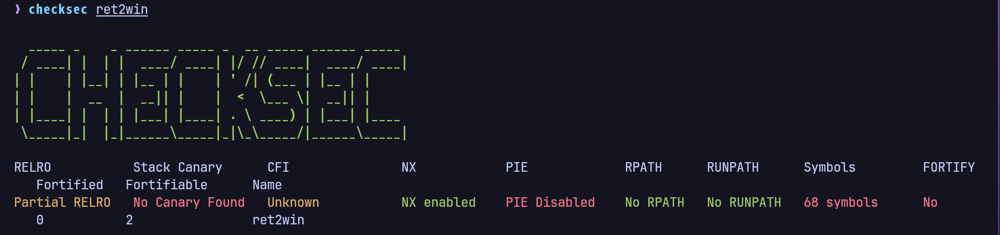
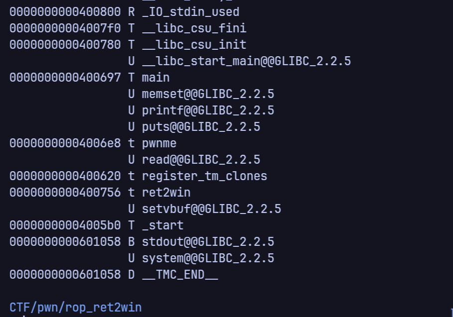
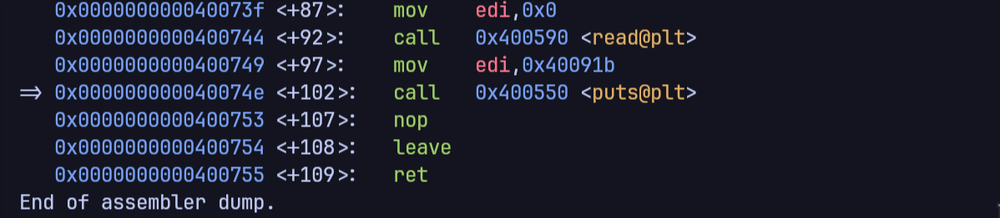
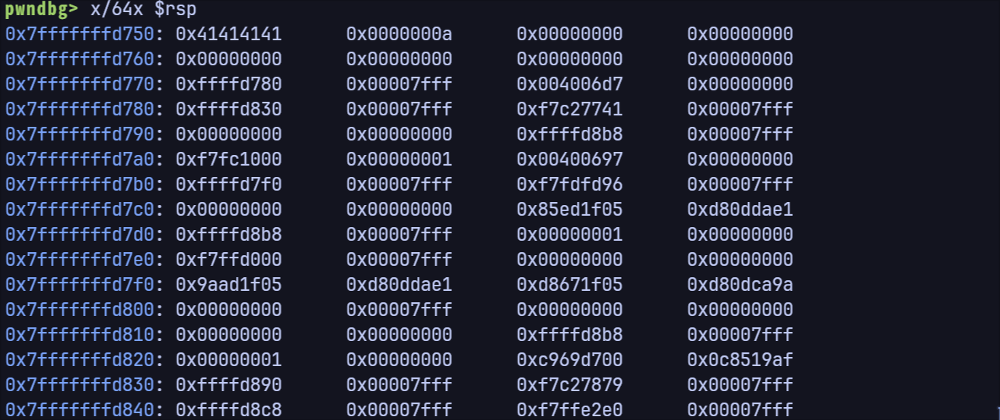
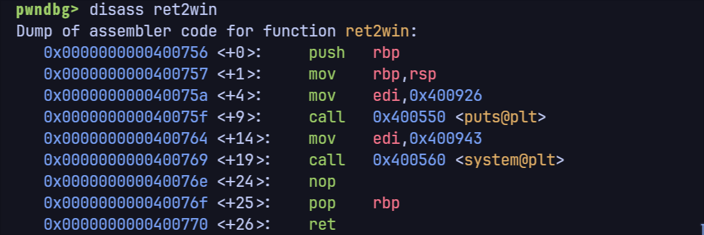
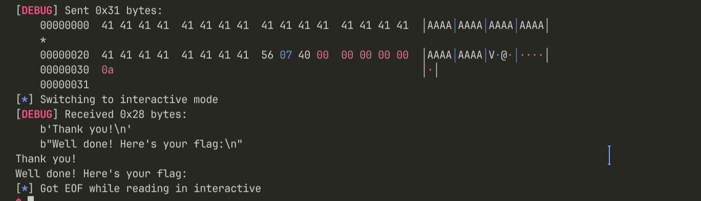
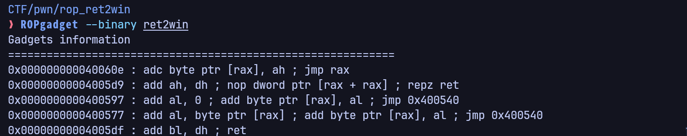
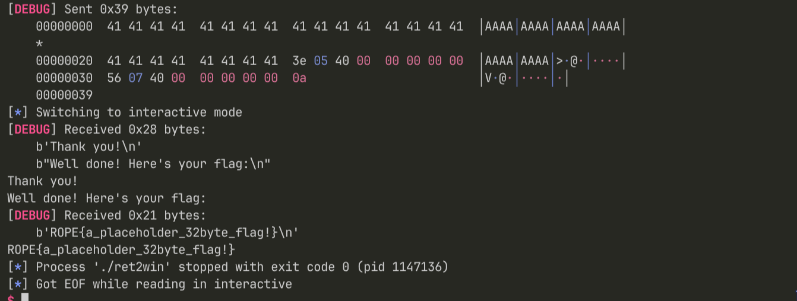

# ROP ret2win - Writeup

---

## Challenge Overview

Buffer overflow in `pwnme()` function. Overflow the buffer and call `ret2win()` to get the flag.

---

## Step 1: Binary Analysis



Key findings:
-PIE disabled
-partial RELRO

---

## Step 2: Symbol Extraction



Using `nm ret2win, we find all function addresses:
- `pwnme` at `0x4006e8` (vulnerable function)
- `ret2win` at `0x400756` (target function)
- `main` at `0x400697`

---

## Step 3: Vulnerable Function Analysis



The `pwnme()` function:
- Allocates 32 bytes local buffer (`sub rsp,0x20`)
- Reads 0x38 (56) bytes via `read()` 
- **Overflow: 56 bytes into 32-byte buffer = 24 byte overflow**


---

## Step 4: Find Offset



Using pwndbg, we inspected the stack after feeding AAAA to the binary.
```
Offset = 40 bytes
```

---

## Step 5: Target Function



The `ret2win()` function:
- Calls `puts()` 
- Calls `system()` to print flag
- Returns

Address: `0x400756`

---

## Step 6: First Attempt - FAILS ❌


Direct jump to `ret2win` without RET gadget:

```
Payload: [40 bytes padding] + [ret2win address]
```

**Result:** SIGSEGV (Segmentation Fault)

**Why?** Stack alignment issue:
- After `pwnme()` returns, RSP is misaligned
- `system()` in PLT uses `movaps xmm0, [rsp]`
- `movaps` requires `RSP % 16 == 0`
- Misaligned RSP = crash 

---

## Step 7: Find RET Gadget



Found simple gadgets:
```
0x40053e: ret
```


This RET gadget will fix alignment by popping one extra value from stack.
rsp = rsp + 8

---

## Step 8: Working Payload with RET Gadget


Corrected payload structure:
```
[40 bytes padding] + [RET gadget] + [ret2win address]
```

When RET gadget executes:
- Pops `ret2win` address into RIP
- RSP += 8 (alignment fixed!)
- Jumps to `ret2win` with proper alignment ✓

---

## Step 9: Success! Flag Captured ** ✓



```
Thank you!
Well done! Here's your flag:
ROPE{a_placeholder_32byte_flag!}
```

Process exits cleanly with code 0.

---

## Why RET Gadget Was Needed

**Without it:** 
- RSP misaligned after overflow
- `movaps` in `system()` PLT crashes

**With it:**
- RET gadget pops one extra time
- RSP becomes aligned
- `system()` loads successfully
- Flag printed!

**One RET instruction = pwned!** ✓
